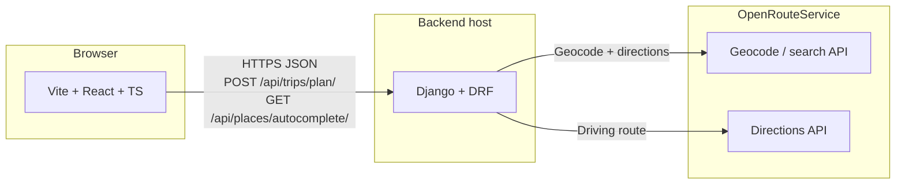
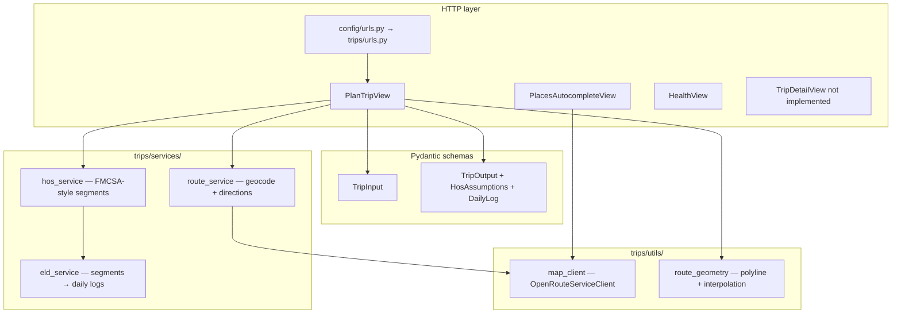
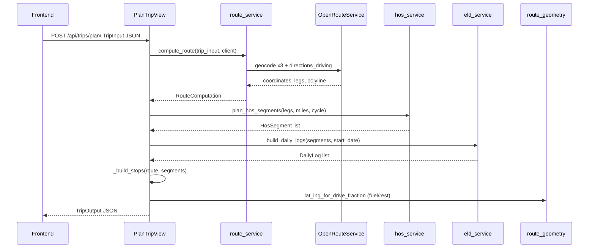
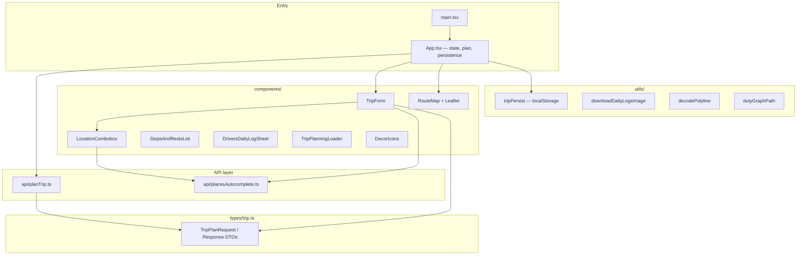
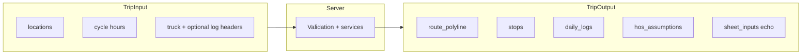

# ELD Trip Planner — architecture (Mermaid)

Use these diagrams in [Mermaid Live Editor](https://mermaid.live), Notion, GitHub/GitLab, or export to PNG/SVG for slides.

---

## 1. System context

External actors and integrations.

---

## 2. Backend layout (Django)

Logical layers inside `backend/`.

---

## 3. Trip planning pipeline (single request)

What happens when the user plans a trip.

---

## 4. Frontend module map

How `frontend/src/` is organized.

---

## 5. Data contract (API boundary)

High-level shapes exchanged at `POST /api/trips/plan/`.

---

## 6. Environment & configuration

Not drawn as code — reference only.

| Piece        | Role |
|-------------|------|
| `ORS_API_KEY` | OpenRouteService auth |
| `VITE_API_BASE_URL` | Frontend → API base URL |
| `CORS_ALLOWED_ORIGINS` | Browser allowed origins for API |

---

### Tips for presenting

- Start with **diagram 1**, then **3** for the “happy path,” then **2** or **4** for depth.
- **Diagram 4** is useful for onboarding engineers on the React side.
- Export: paste each fenced block into [mermaid.live](https://mermaid.live) → Actions → PNG/SVG.
